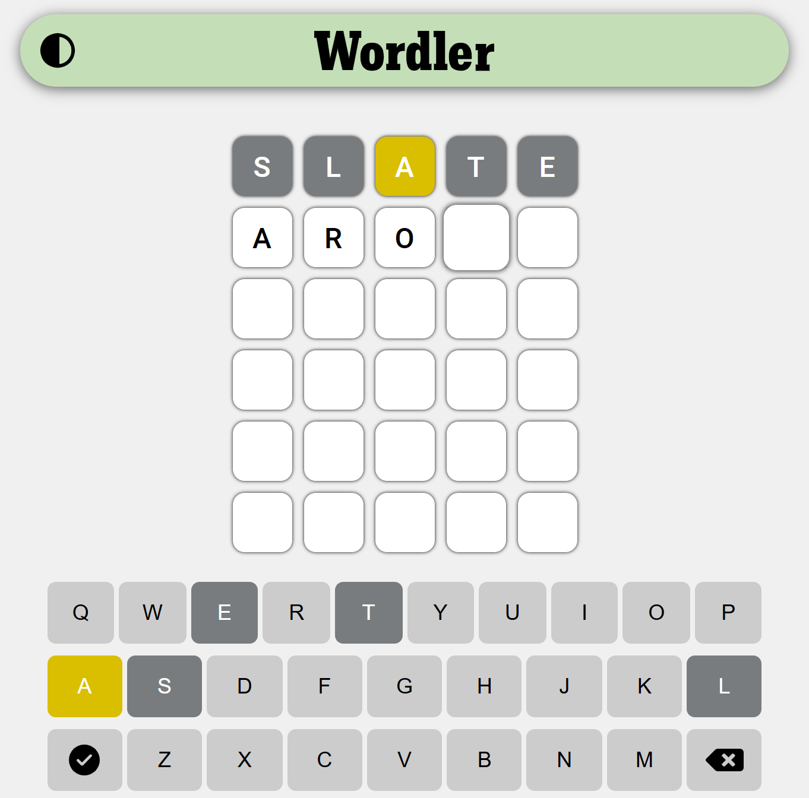

# Wordler 🟢🟡⚪

Wordler is a recreation of the popular word-guessing game, Wordle. This project aims to provide a fun and challenging experience for players who enjoy word puzzles.
<div style="width:100%;display:flex;justify-content:center;align-items:center;">

</div>

## 🚀 Introduction 

Wordler is a word-guessing game where players have six attempts to guess a hidden five-letter word. After each guess, the game provides feedback on which letters are correct and in the correct position, and which letters are correct but in the wrong position.
<div style="width:100%;display:flex;justify-content:center;align-items:center;flex-direction:column">

<i>Screenshot</i>
</div>

🟨⬜⬜🟨🟨
## ⚡ Features

- Play unlimited
- Theme changing
- User-friendly simple interface
- Responsive design for smaller screens

⬜🟩🟨🟨⬜
## 💾 Use Locally

If you want to install and play it locally, download it as a ZIP file, and unzip it

⬜🟩🟨🟩⬜
## 🎮 Usage 

To play Wordler, just go to <a href="https://the-amazing-wordle-game-recreation.vercel.app/">This link</a>. 
To play locally, open ```index.html``` file from the downloaded file.

🟩🟩🟨🟩🟨
##  🌟 Contributing

Contributions are welcome! If you have any ideas, suggestions, or bug reports, please open an issue or submit a pull request. For major changes, please open an issue first to discuss what you would like to change.

🟩🟩🟨🟩🟨
<!--
## License

This project is licensed under the MIT License. See the LICENSE file for details. -->
##  📃 Acknowledgements

- Inspired by the original [Wordle](https://www.nytimes.com/games/wordle/index.html) game by Josh Wardle.
- This game is only for fun, so you can do anything with it.

🟩🟩🟩🟩🟩

<pre style="text-align:center">
🟨⬜⬜🟨🟨
⬜🟩🟨🟨⬜
⬜🟩🟨🟩⬜
🟩🟩🟨🟩🟨
🟩🟩🟩🟩🟩
</pre>


## 🔧 How it works 
### Input:
- Looks for the user to press a letter on the keyboard.
- Writes that letter to the focused box/tile.
- Switches focus to the next box
- If `backspace` is pressed, switch the focus to the privous box, and remove the letter in it.
- If the key is `enter`, it checks and gives feedback, and goes to the next row.

### Color feadback
- For giving feedback (Green, Yellow, and Grey), first it checks for exact matches, the correct letter in the correct place, and makes the box green.
- Then it checks for yellow, and grey.
- For showing yellow and grey, which means the letter is preasent/doesn't exist in the answer, It takes different approach, than the `answer.includes(letter)`, for every box, first it goes through every box, and checks for matched letters for avoiding highlighting extra letters


